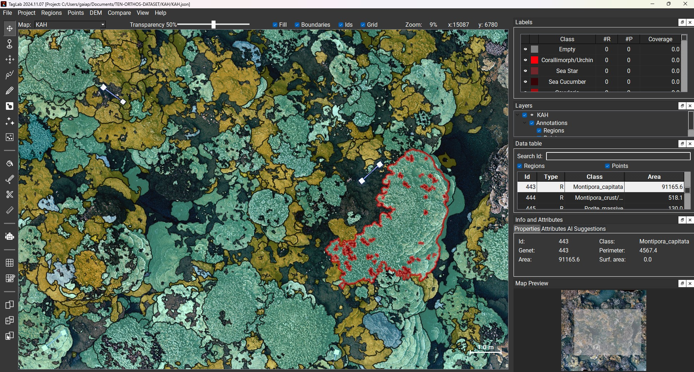

# TagLab: an image segmentation tool oriented to marine data analysis

| &nbsp; [Software Requirements](#software-requirements) &nbsp; | &nbsp; [Install](#installing-taglab) &nbsp; | &nbsp; [Update](#updating-taglab) &nbsp; | &nbsp; [Citation](#citation) &nbsp; |


## Introduction

TagLab was created to support the activity of annotation and extraction of statistical data from ortho-maps of benthic communities. The tool includes different types of CNN-based segmentation networks specially trained for agnostic (relative only to contours) or semantic (also related to species) recognition of corals. TagLab is an ongoing project of the  [Visual Computing Lab](https://vcg.isti.cnr.it).




## Interaction
TagLab allows to :

- zoom and navigate a large map using (zoom/mouse wheel, pan/'Move' tool selected + left button). With every other tool selected the pan is activated with ctrl + left button
- segment coral instances in a semi-automatic way by indicating the corals' extremes with the 4-clicks tool. This is achieved using the Deep Extreme Cut network fine-tuned on coral images. Deep Extreme Cut original code can be found here: https://github.com/scaelles/DEXTR-PyTorch
- segment coral instances in a semi-automatic way by indicating the interior and the exterior of a coral using the positive-negative clicks tool. Use shift+left mouse button to assign the positive (the interior) points and shift+right mouse button to assign the negative (the exterior) points. This tool is based on the RITM interactive segmentation project, code and additional information can be found here: https://github.com/saic-vul/ritm_interactive_segmentation
- assign a class with the 'Assign class' tool or double-clicking the class in the labels panel
- Area, perimeter and other information are displayed in the region info panel on the right
- simultaneously turn off the visibility of one or more classes, (ctrl + left button/disable all but the selected, shift + left button, inverse operation), change the class transparency using the above slider
- perform boolean operations between existing labels (right button to open the menu)
- refine the incorrect borders automatically with the Refine operation or manually with the 'Edit Border' tool
- tracking coral changes in different time intervals
- import depth information of the seafloor
- import GeoTiff
- draw coral internal cracks with the 'Create Crack' tool
- make freehand measurements or measure the distance between centroids (Ruler tool).
- save the annotations (as polygons) and import them into a new project
- export a CSV file table containing the data of each coral colony
- export a JPG file of a black background with totally opaque labels
- export shapefiles
- export a new dataset and train your network (!)

#### ✨ New Features:
- 10/2023
  - Install script for Windows using [Anaconda](https://docs.conda.io/projects/miniconda/en/latest/); see Installation instructions below
  - [Segment Anything Model (SAM)](https://github.com/facebookresearch/segment-anything) 
    - [`Predictor` for one-click segmentations](https://www.youtube.com/watch?v=3dMo2NO1iXQ)
    - [`Generator` for automatic segmentations](https://www.youtube.com/watch?v=3dMo2NO1iXQ)
- 12/2023
  - Width and Height of current view is shown in top-right (updates w/ zoom)
  - Users can mark grid cells as complete from within SAM and pos/neg (RITM) tools
  - Working area for SAM and pos/neg (RITM) tools will show you the dimensions of the working area
- 02/2024
  - [`iView`](https://www.youtube.com/watch?v=H3AjshATPy0) using Metashape API to view corresponding images of orthomosaic; requires Professional license
  - Fixed `Refine` tool bug
  - Point annotations (**all credit goes to original TagLab authors**)
    - Point sampling select work area (shows pixel and metric space)
    - Basic Import / Export of point annotations in CoralNet Format
- 03/2024
  - Integrated `Upload` and `API` tools from [`CoralNet Toolbox`](https://github.com/Jordan-Pierce/CoralNet-Toolbox) into `TagLab` to allow for `CoralNet` models to make predictions on point annotations in orthomosaic.

We are working hard to create a website with detailed instructions about TagLab. Stay tuned(!)


## Software Requirements


TagLab runs on __Linux__, __Windows__, and __MacOS__. To run TagLab, the main requirement is just __64bit Python 3.8.x, 3.9.x or 3.10.x__.

GPU accelerated computations are not supported on MacOS and on any machine that has not an NVIDIA graphics card.
To use them, you'll need to install the __NVIDIA CUDA Toolkit__, versions 10.2, 11.3, 11.6 and 11.7 are supported.
If you don't have a NVida graphics card (or if you use MacOS), CPU will be used.

## Installing TagLab

To install TagLab on Windows using [Anaconda](https://docs.conda.io/projects/miniconda/en/latest/), follow the
instructions below. If CUDA is not installed on your computer, include `cpu` when running the install script:
```python
# Anaconda Command Prompt

# Create a conda environment for TagLab
conda create --name taglab python=3.8 -y

# Activate the environment
conda activate taglab

# Within the TagLab folder, run the install_conda_windows.py script
python install_conda_windows.py [cpu]

# Run TagLab
python Taglab.py
```
For further instructions on installing TagLab see below.

### Step 1: Install Anaconda

1. **Download Anaconda:**
   - Go to the [Anaconda website](https://www.anaconda.com/products/distribution).
   - Download the appropriate version for your Windows system (e.g., 64-bit or 32-bit).
   - Follow the installation instructions provided on the website.

### Step 2: Open Anaconda Command Prompt

1. **Search for Anaconda Command Prompt:**
   - Press the `Windows` key on your keyboard.
   - Type "Anaconda Command Prompt" and press `Enter`.

### Step 3: Create a Conda Environment for TagLab

1. **Create a new conda environment:**
   - In the Anaconda Command Prompt, type the following command and press `Enter`:
     ```bash
     conda create --name taglab python=3.8 -y
     ```
   - This command creates a new conda environment named "taglab" with Python version 3.8.

### Step 4: Activate the Conda Environment

1. **Activate the conda environment:**
   - Type the following command and press `Enter`:
     ```bash
     conda activate taglab
     ```
   - Your command prompt should now show that you are in the "taglab" environment.

### Step 5: Download TagLab and Install Dependencies

1. **Navigate to the TagLab folder:**
   - Download this TagLab fork .
   - Extract the contents of the downloaded zip file to a location on your computer.
   - Open the Anaconda Command Prompt and navigate to the folder where TagLab is extracted, using the `cd` command. For example:
     ```bash
     cd path\to\Taglab
     ```

2. **Run the installation script:**
   - Type the following command and press `Enter`:
     ```bash
     python install_conda_windows.py [cpu]
     ```
     - Replace `[cpu]` with nothing if CUDA is installed on your computer, or include `cpu` if CUDA is not installed.
     - This script installs the necessary dependencies for TagLab.

### Step 6: Run TagLab

1. **Run TagLab:**
   - After the installation is complete, you can run TagLab using the following command:
     ```bash
     python Taglab.py
     ```
   - This command starts TagLab, and you should now be able to use the tool within the activated conda environment.


## Updating TagLab

If you already installed TagLab and you need to update to a new version, you can just run the `update.py` script from the terminal (be sure to be into the TagLab main folder, see step 2):

```
python3 update.py
```
or, on Windows:

```
python.exe update.py
```

The script will automatically update TagLab to the newest version available in this repository.

NOTE: If some package is missing, after an update, re-launch install.py .

### Updating from 0.2

If you are updating TagLab from 0.2 version, in order to download also the new networks, please run the `update.py` script twice:

```
python3 update.py
python3 update.py
```


# Citation

If you use TagLab, please cite it.

```
@article{TagLab,
	author = {Pavoni, Gaia and Corsini, Massimiliano and Ponchio, Federico and Muntoni, Alessandro and Edwards, Clinton and Pedersen, Nicole and Sandin, Stuart and Cignoni, Paolo},
	title = {TagLab: AI-assisted annotation for the fast and accurate semantic segmentation of coral reef orthoimages},
	year = {2022},
	journal = {Journal of Field Robotics},
	volume = {39},
	number = {3},
	pages = {246 – 262},
	doi = {10.1002/rob.22049}
}
```